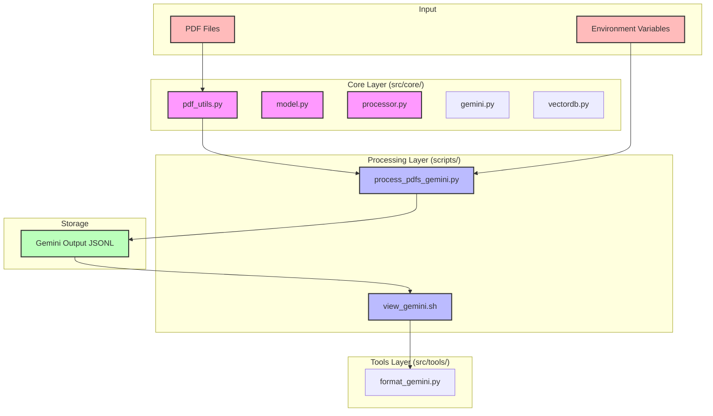

# DrSedman System Architecture



## Component Descriptions

### Input Layer
- **PDF Files**: Source geoscience documents to be processed
- **Environment Variables**: Configuration including API keys

### Core Layer (`src/core/`)
- **pdf_utils.py**: PDF processing and text extraction
- **model.py**: Model interface and configuration
- **processor.py**: Core processing logic
- **gemini.py**: Handles PDF processing with Gemini API
- **vectordb.py**: Manages vector database operations

### Processing Layer (`scripts/`)
- **process_pdfs_gemini.py**: Main processing script
  - Handles PDF ingestion
  - Manages Gemini API interaction
  - Generates structured geoscience JSON output
- **view_gemini.sh**: Output viewing utility
  - Randomly selects processed files
  - Triggers formatting display

### Tools Layer (`src/tools/`)
- **format_gemini.py**: Output formatting utility
  - Parses JSONL files
  - Renders formatted console output
  - Handles structured geoscience data display

### Storage Layer
- **Gemini Output JSONL**: Structured output storage
  - Contains processed results
  - Includes metadata and content
  - One JSON object per line

## Data Flow

1. Geoscience PDF files are processed by `pdf_utils.py`
2. `process_pdfs_gemini.py` coordinates processing:
   - Extracts text using `pdf_utils.py`
   - Sends to Gemini API
   - Stores results in JSONL
3. Results can be viewed via:
   - `view_gemini.sh` selects files
   - `format_gemini.py` renders output

## File Structure
```
drsedman/
├── src/
│   ├── core/
│   │   ├── pdf_utils.py
│   │   ├── model.py
│   │   ├── processor.py
│   │   ├── gemini.py
│   │   └── vectordb.py
│   ├── processing/
│   │   └── gemini.py
│   └── tools/
│       └── format_gemini.py
├── scripts/
│   ├── run_gemini_processing.zsh
│   └── view_gemini.sh
├── gemini_output/
│   └── *_gemini.jsonl
└── data/
    └── pdfs/
```
